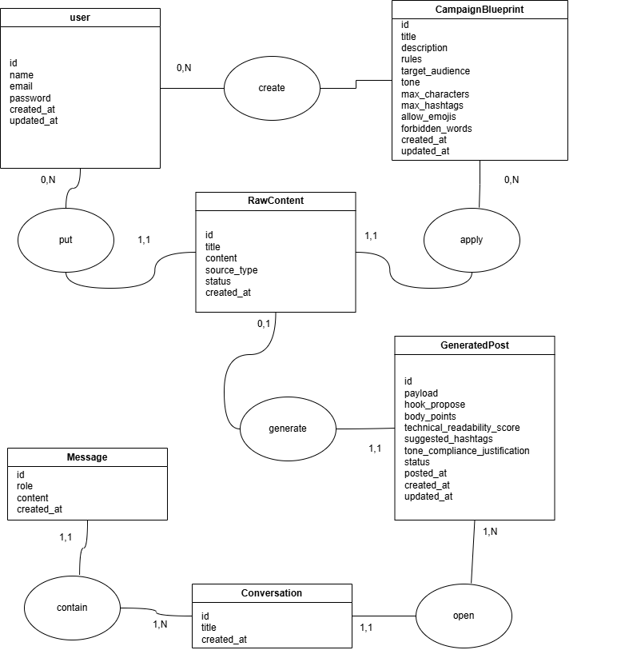
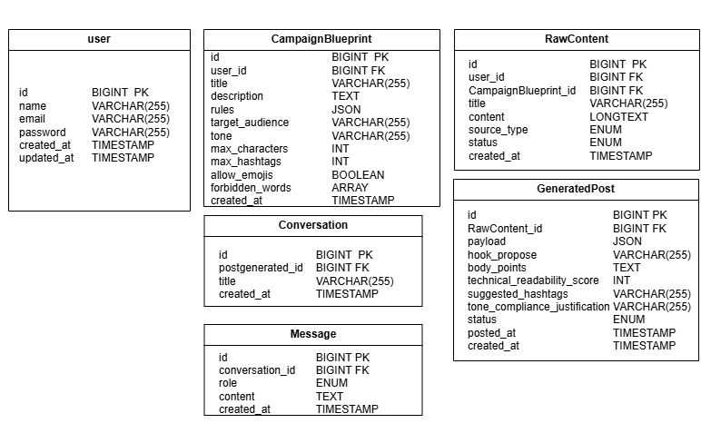
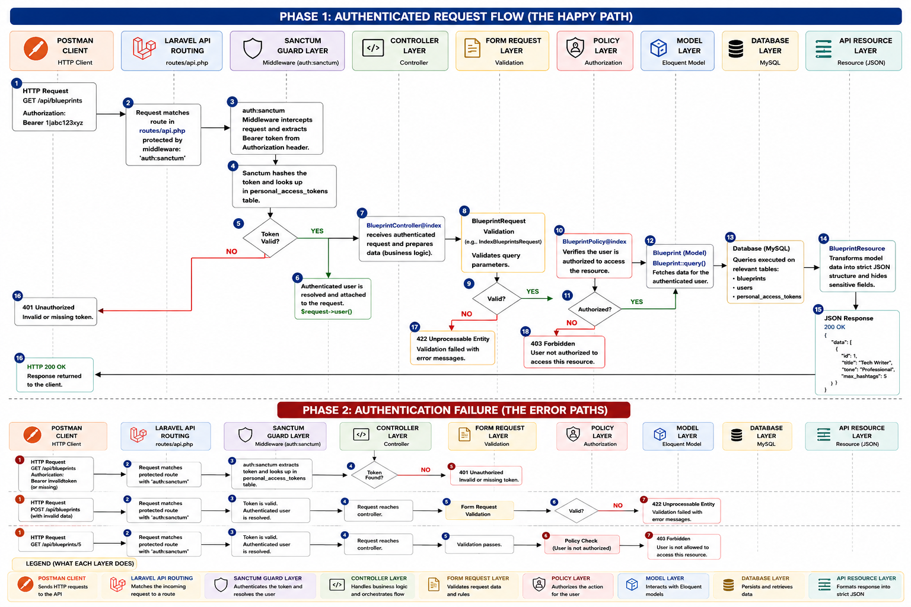
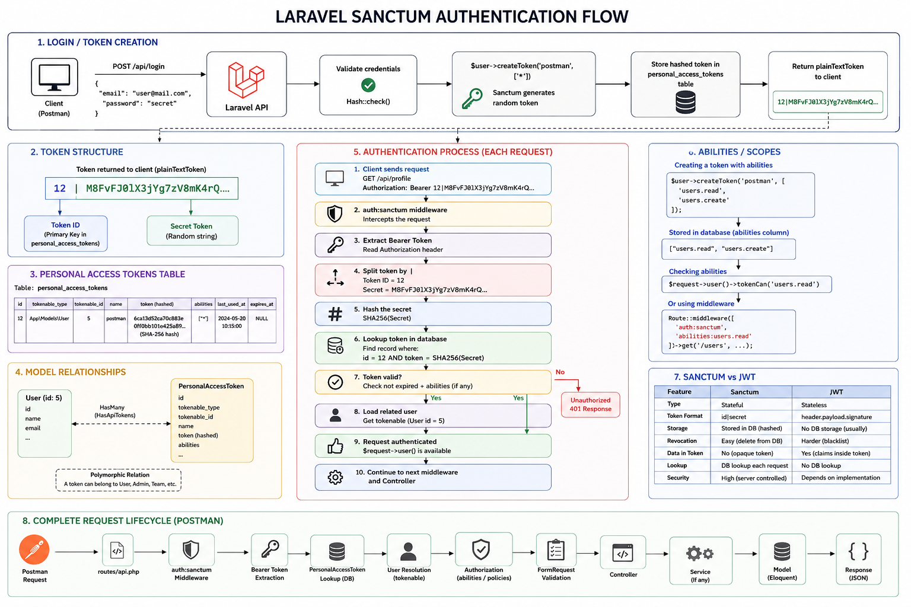

# ThreadForge API

## Overview

**ThreadForge API** is a headless Laravel REST API that helps technology content creators transform raw technical content into optimized X (Twitter) posts using AI.

The platform allows users to:

- Create reusable style configurations (Blueprints)
- Submit raw content such as notes, blog articles, markdown files, or GitHub README content
- Generate structured social media posts through AI
- Manage generated content lifecycle
- Interact with an AI Ghostwriter Assistant
- Use conversation memory and tool calling capabilities

This project is **API-only** and contains no frontend.

---

## Business Goal

Provide an affordable internal alternative to content repurposing tools such as Taplio and Buffer while maintaining full control over style, prompts, AI workflows, and generated content.

---

# 🚀 Features

# 🔐 Authentication

Users can:

- Register securely
- Login securely
- Logout securely

Authentication is powered by **Laravel Sanctum** with Bearer Token authentication.

---

# 🎨 Blueprint Management

Users can:

- Create blueprints
- Edit blueprints
- View blueprint details
- List all blueprints
- Delete blueprints
- Duplicate blueprints

Each blueprint includes:

- Title
- Description
- Rules (JSON array)
- Target audience
- Tone
- Max hashtags
- Max characters
- Allow emojis
- Forbidden words (JSON array)
- Additional rules

---

# 📝 Raw Content Submission

Users can:

- Submit raw technical content (notes, blogs, markdown, READMEs)
- List all submissions
- View submission details

Each raw content includes:

- Title
- Raw content body
- Blueprint association
- Status

## RawContent Status values

| Value | Description |
|---|---|
| `pending` | Awaiting AI processing |
| `processing` | AI generation in progress |
| `completed` | AI generation finished successfully |
| `failed` | AI generation failed |

Submission is **asynchronous** — the API returns `202 Accepted` immediately and processes AI generation via a queue job.

---

# 🤖 AI Post Generation

The system:

- Processes raw content using the associated blueprint rules
- Generates structured output via `laravel/ai`
- Validates response against a strict schema
- Persists the generated post
- Handles failures with automatic retries

Generated output structure:

```json
{
  "hook_propose": "string",
  "body_points": ["string"],
  "technical_readability_score": 0,
  "suggested_hashtags": ["string"],
  "tone_compliance_justification": "string"
}
```

## Queue Retry Strategy

| Attempt | Delay |
|---|---|
| 1st retry | 10 seconds |
| 2nd retry | 30 seconds |
| 3rd retry | 60 seconds |

---

# 📋 Post Lifecycle

Users can:

- View generated posts
- View post details
- Update publication status

## GeneratedPost Status values

| Value | Description |
|---|---|
| `draft` | Generated but not published |
| `posted` | Published to X (Twitter) |
| `archived` | Archived |

Status transitions:

- Moving to `posted` automatically sets the `posted_at` timestamp
- Moving from `posted` to another status clears `posted_at`

---

# 💬 AI Ghostwriter Assistant

Users can:

- Chat with an AI assistant about a specific generated post
- Request alternative hooks
- Get tone adjustments
- Generate more hashtags
- Request multiple variations

The assistant uses:

- **Tool Calling** — Real Laravel tools to access blueprint rules (`GetCampaignRules`) and post history (`GetPostHistory`)
- **Conversation Memory** — Remembers previous messages within the same conversation via `laravel/ai` memory capabilities
- **Contextual Awareness** — Understands the post content and blueprint constraints

---

# 🛠 Installation

### Prerequisites

- PHP 8.3+
- Composer
- Node.js + NPM
- MySQL

### Installation Steps

1. Clone the repository

```bash
git clone https://github.com/your-username/threadforgeapi.git
cd threadforgeapi
```

2. Install dependencies

```bash
composer install
npm install
```

3. Environment configuration

```bash
cp .env.example .env
php artisan key:generate
```

4. Configure database

Edit `.env`:

```ini
DB_CONNECTION=mysql
DB_HOST=127.0.0.1
DB_PORT=3306
DB_DATABASE=threadforge
DB_USERNAME=root
DB_PASSWORD=
```

5. Configure AI provider

Set your preferred AI provider key in `.env`:

```ini
OPENAI_API_KEY=your-key-here
# or
GROQ_API_KEY=your-key-here
```

6. Run migrations

```bash
php artisan migrate
```

7. Generate API documentation

```bash
php artisan scribe:generate
```

8. Start the queue worker (required for AI generation)

```bash
php artisan queue:work
```

9. Start the development server

```bash
php artisan serve
```

The API will be available at:

```
http://127.0.0.1:8000/api
```

### Development Script

```bash
npm run dev
```

Starts the PHP server, queue listener, and Vite concurrently.

---

# 📁 Directory Structure

```text
app/
├── Ai/
│   ├── Agents/
│   │   └── PostChatAgent.php
│   └── Tools/
│       ├── GetCampaignRules.php
│       └── GetPostHistory.php
├── Enums/
│   ├── GeneratedPostStatus.php
│   └── RawContentStatus.php
├── Http/
│   ├── Controllers/
│   │   ├── AuthController.php
│   │   ├── BlueprintController.php
│   │   ├── ChatController.php
│   │   ├── GeneratedPostController.php
│   │   └── RawContentController.php
│   ├── Requests/
│   │   ├── Auth/
│   │   │   ├── LoginRequest.php
│   │   │   └── RegisterRequest.php
│   │   ├── BlueprintRequest.php
│   │   ├── ChatRequest.php
│   │   ├── RawContentRequest.php
│   │   └── UpdateGeneratedPostStatusRequest.php
│   └── Resources/
│       ├── BlueprintResource.php
│       ├── GeneratedPostResource.php
│       ├── RawContentResource.php
│       └── UserResource.php
├── Jobs/
│   └── GeneratePostJob.php
├── Models/
│   ├── Blueprint.php
│   ├── GeneratedPost.php
│   ├── RawContent.php
│   └── User.php
├── Providers/
│   ├── AppServiceProvider.php
│   └── TelescopeServiceProvider.php
└── Services/
    ├── AiGenerationService.php
    ├── AuthService.php
    └── BlueprintService.php

config/
├── ai.php
├── sanctum.php
├── scribe.php
└── telescope.php

database/
├── factories/
│   ├── BlueprintFactory.php
│   ├── GeneratedPostFactory.php
│   ├── RawContentFactory.php
│   └── UserFactory.php
├── migrations/
└── seeders/
    └── DatabaseSeeder.php

routes/
└── api.php

tests/
├── Feature/
│   ├── Ai/
│   │   ├── GetCampaignRulesToolTest.php
│   │   └── GetPostHistoryToolTest.php
│   ├── Auth/
│   │   ├── LoginTest.php
│   │   ├── LogoutTest.php
│   │   ├── RegistrationTest.php
│   │   └── SanctumProtectionTest.php
│   ├── Blueprint/
│   │   ├── CreateBlueprintTest.php
│   │   ├── DeleteBlueprintTest.php
│   │   ├── DuplicateBlueprintTest.php
│   │   ├── ListBlueprintTest.php
│   │   └── UpdateBlueprintTest.php
│   ├── Chat/
│   │   ├── ChatAccessTest.php
│   │   ├── ChatMemoryTest.php
│   │   ├── ChatMessageMaxLengthTest.php
│   │   └── ChatMessageTest.php
│   ├── GeneratedPost/
│   │   ├── GeneratedPostAccessTest.php
│   │   ├── GeneratedPostResourceTest.php
│   │   ├── ListGeneratedPostTest.php
│   │   └── UpdateGeneratedPostStatusTest.php
│   ├── Queue/
│   │   └── GeneratePostTest.php
│   ├── RawContent/
│   │   ├── ContentStatusTest.php
│   │   ├── ListRawContentTest.php
│   │   └── SubmitRawContentTest.php
│   └── ExampleTest.php
├── Unit/
│   ├── Enums/
│   │   ├── GeneratedPostStatusTest.php
│   │   └── RawContentStatusTest.php
│   ├── Models/
│   │   ├── BlueprintModelTest.php
│   │   ├── GeneratedPostModelTest.php
│   │   ├── RawContentModelTest.php
│   │   └── UserModelTest.php
│   ├── Services/
│   │   ├── AiGenerationServiceTest.php
│   │   ├── AuthServiceTest.php
│   │   └── BlueprintServiceTest.php
│   └── ExampleTest.php
├── Pest.php
└── TestCase.php
```

---

# 🛣 API Endpoints

## Authentication

| Method | URI | Controller | Action |
|---|---|---|---|
| POST | `/api/register` | `AuthController` | `register` |
| POST | `/api/login` | `AuthController` | `login` |
| POST | `/api/logout` | `AuthController` | `logout` |

## Blueprints

| Method | URI | Controller | Action |
|---|---|---|---|
| GET | `/api/blueprints` | `BlueprintController` | `index` |
| POST | `/api/blueprints` | `BlueprintController` | `store` |
| GET | `/api/blueprints/{blueprint}` | `BlueprintController` | `show` |
| PUT | `/api/blueprints/{blueprint}` | `BlueprintController` | `update` |
| DELETE | `/api/blueprints/{blueprint}` | `BlueprintController` | `destroy` |
| POST | `/api/blueprints/{blueprint}/duplicate` | `BlueprintController` | `duplicate` |

## Raw Contents

| Method | URI | Controller | Action |
|---|---|---|---|
| GET | `/api/raw-contents` | `RawContentController` | `index` |
| POST | `/api/raw-contents` | `RawContentController` | `store` |
| GET | `/api/raw-contents/{rawContent}` | `RawContentController` | `show` |

## Generated Posts

| Method | URI | Controller | Action |
|---|---|---|---|
| GET | `/api/generated-posts` | `GeneratedPostController` | `index` |
| GET | `/api/generated-posts/{generatedPost}` | `GeneratedPostController` | `show` |
| PATCH | `/api/generated-posts/{generatedPost}/status` | `GeneratedPostController` | `update` |

## AI Assistant

| Method | URI | Controller | Action |
|---|---|---|---|
| POST | `/api/posts/{post}/chat` | `ChatController` | `__invoke` |

## User

| Method | URI | Controller | Action |
|---|---|---|---|
| GET | `/api/user` | Closure | Returns current user |

---

# 🗄 Database Design

## Tables

- `users`
- `blueprints`
- `raw_contents`
- `generated_posts`
- `agent_conversations`
- `agent_conversation_messages`
- `personal_access_tokens`

## Relationships

- **User → Blueprints:** One user has many blueprints (`hasMany`)
- **User → RawContents:** One user has many raw contents (`hasMany`)
- **User → GeneratedPosts:** One user has many generated posts through raw contents (`hasManyThrough`)
- **Blueprint → RawContents:** One blueprint has many raw contents (`hasMany`)
- **RawContent → GeneratedPost:** One raw content has one generated post (`hasOne`)
- **GeneratedPost → RawContent:** One generated post belongs to one raw content (`belongsTo`)

## Eloquent Casts

| Model | Field | Cast |
|---|---|---|
| `Blueprint` | `rules` | `array` |
| `Blueprint` | `forbidden_words` | `array` |
| `Blueprint` | `allow_emojis` | `boolean` |
| `Blueprint` | `max_hashtags` | `integer` |
| `Blueprint` | `max_caracteres` | `integer` |
| `RawContent` | `statut` | `RawContentStatus` (enum) |
| `GeneratedPost` | `body_points` | `array` |
| `GeneratedPost` | `suggested_hashtags` | `array` |
| `GeneratedPost` | `payload_brut` | `array` |
| `GeneratedPost` | `statut` | `GeneratedPostStatus` (enum) |
| `GeneratedPost` | `technical_readability_score` | `integer` |
| `GeneratedPost` | `posted_at` | `datetime` |

## MCD



## MLD



---

# 📌 Laravel Concepts Used

### API Resources

Used for consistent JSON responses:

- `BlueprintResource`
- `GeneratedPostResource`
- `RawContentResource`
- `UserResource`

### Form Requests

Used for validation:

- `RegisterRequest` — Registration validation
- `LoginRequest` — Login validation
- `BlueprintRequest` — Blueprint CRUD validation
- `RawContentRequest` — Raw content submission validation (including blueprint ownership check)
- `UpdateGeneratedPostStatusRequest` — Status update validation
- `ChatRequest` — Chat message validation (max 5000 characters)

### Service Classes

Business logic extracted from controllers:

- `AuthService` — Login attempt and token creation
- `BlueprintService` — Blueprint duplication
- `AiGenerationService` — AI prompt building and generation

### Queue Jobs

- `GeneratePostJob` — Async AI generation with retry support (3 tries)

### Enums

- `RawContentStatus` — `pending`, `processing`, `completed`, `failed`
- `GeneratedPostStatus` — `draft`, `posted`, `archived`

### Eloquent Casts

Array, boolean, integer, datetime, and backed enum casts.

### Sanctum

API token authentication with Bearer tokens.

### laravel/ai

- **Structured Output** — Schema-validated AI responses
- **Tool Calling** — Real Laravel tools (`GetCampaignRules`, `GetPostHistory`)
- **Conversation Memory** — Per-user, per-post conversation persistence

### Named Routes

All routes are named for clean references.

### Route Model Binding

Models are automatically resolved in route parameters.

---

# 🛠 Technologies Used

- **Laravel 13**
- **PHP 8.3+**
- **MySQL**
- **Eloquent ORM**
- **Laravel Sanctum**
- **Laravel AI**
- **Laravel Queues**
- **Laravel Telescope**
- **Scribe**
- **Pest PHP**

---

# 🔒 Security Measures

The application implements several Laravel security best practices:

- Sanctum token authentication
- Password hashing
- CSRF protection
- Form Request validation
- Ownership verification (user_id match)
- Protected routes via `auth:sanctum` middleware
- Sensitive fields excluded from API responses (password, remember_token)

---

# 🧪 Testing (Pest)

The project uses **Pest PHP** — an elegant testing framework built on top of PHPUnit.

**Total test files: 34** (24 Feature, 10 Unit)

### Configuration

Pest is configured in `tests/Pest.php`:

```php
pest()->extend(TestCase::class)
    ->use(RefreshDatabase::class)
    ->in('Feature');

pest()->extend(TestCase::class)
    ->use(RefreshDatabase::class)
    ->in('Unit');
```

- All tests automatically refresh the database
- The `phpunit.xml` file uses an SQLite in-memory database for testing

### Test Coverage

- **Auth:** Registration, login, logout, Sanctum protection
- **Blueprints:** Create, list, view, update, delete, duplicate, authorization
- **Raw Contents:** Submit, list, view, status lifecycle, authorization
- **Generated Posts:** List, view, status transitions, resource structure, authorization
- **Chat:** Send messages, access control, memory, max length validation
- **Queue:** Job dispatching, AI generation flow, retry strategy
- **AI Tools:** `GetCampaignRules` and `GetPostHistory` tool tests
- **Enums:** Value correctness and count assertions
- **Models:** Fillable attributes, casts, relationships, factories, traits
- **Services:** AuthService, BlueprintService, AiGenerationService

### Running Tests

Run all tests:

```bash
php artisan test
```

Run a specific file:

```bash
php artisan test tests/Feature/Blueprint/CreateBlueprintTest.php
```

Run with coverage (requires Xdebug or PCOV):

```bash
php artisan test --coverage
```

---

# 🐞 Debugging

### Laravel Telescope

Access at `/telescope`

Used to:

- Inspect requests
- View exceptions
- Monitor queries
- Debug authorization

### API Flow Diagram



### Sanctum Authentication Flow



---

# 📋 API Documentation

Full interactive API documentation is generated with **Scribe**.

Generate documentation:

```bash
php artisan scribe:generate
```

Access at:

```
http://127.0.0.1:8000/docs
```

---

# 📁 Storage

No file uploads are used in this project. All data is stored in the database.
